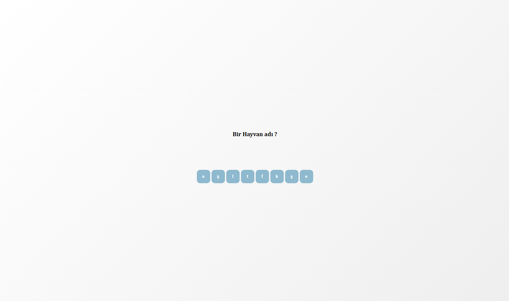
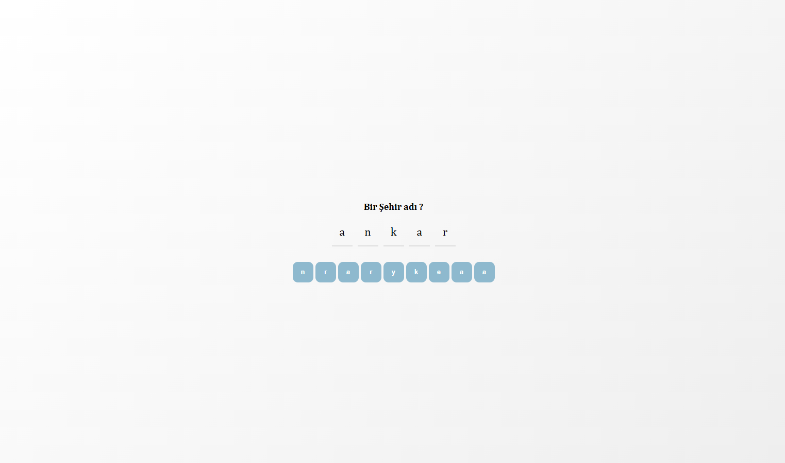
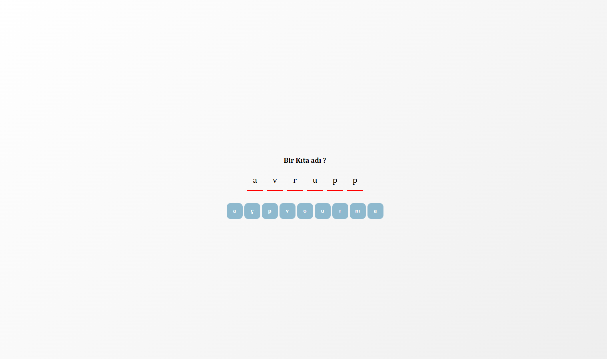
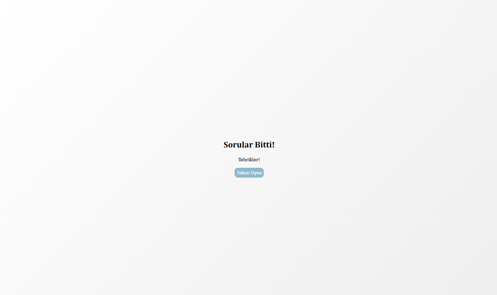

# Patika+ Frontend Bootcamp (Adam Asmaca Oyunu)

Bu proje, React kullanılarak geliştirilmiş modern bir Adam Asmaca oyunudur.

## Özellikler

- Türkçe karakter desteği
- Rastgele harf seçenekleri
- Yanlış cevaplarda görsel geri bildirim
- Tekrar oynama özelliği
- Responsive tasarım

## Kurulum

```bash
# Projeyi klonlayın
git clone [https://github.com/emreykaya/op-adam-asmaca]

# Proje dizinine gidin
cd op-adam-asmaca

# Bağımlılıkları yükleyin
npm install

# Uygulamayı başlatın
npm run dev
```

## Nasıl Oynanır?

1. Ekranda görünen soruyu okuyun
2. Cevabı oluşturmak için harfleri seçin
3. Doğru cevabı bulduğunuzda otomatik olarak bir sonraki soruya geçin
4. Yanlış cevap verirseniz harfleri silip tekrar deneyin
5. Tüm soruları bitirdiğinizde "Tekrar Oyna" butonu ile yeniden başlayın

## Teknolojiler

- React
- Vite
- CSS3
- HTML5

## Ekran Görüntüleri




